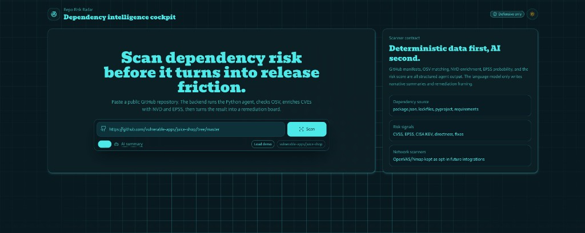
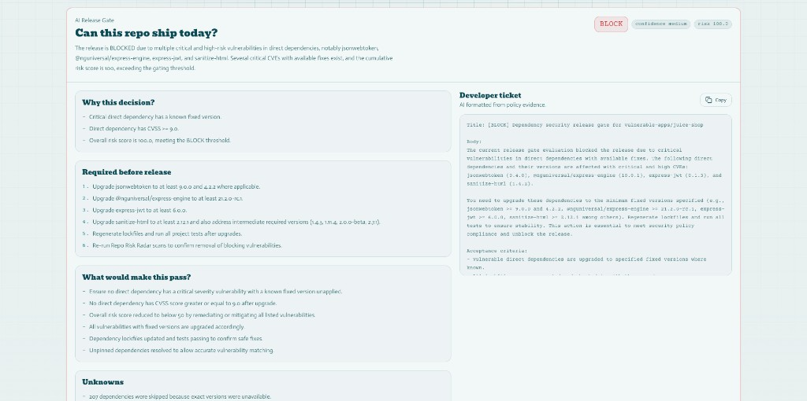
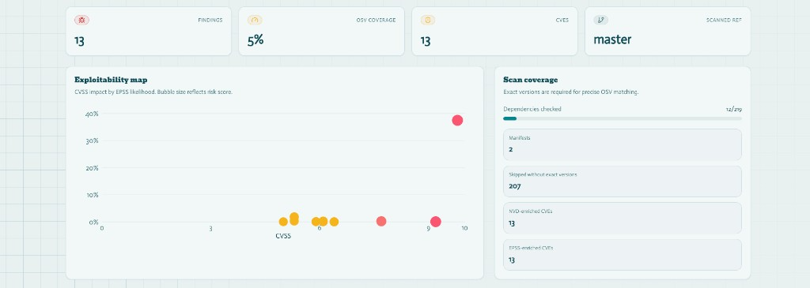
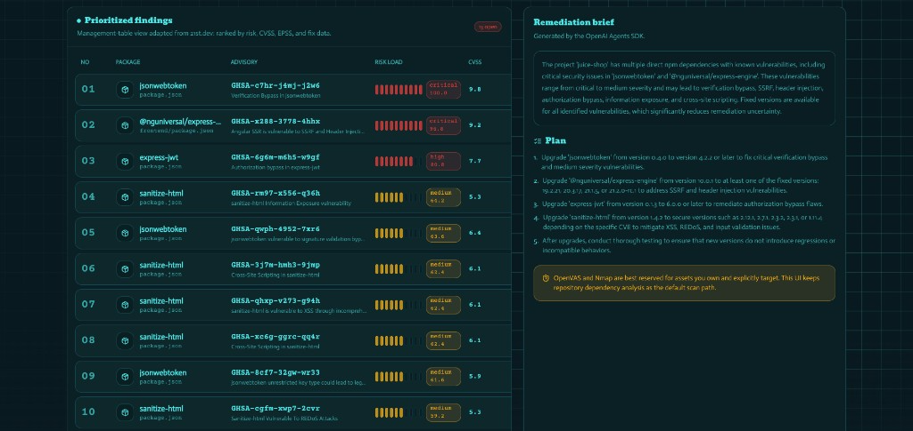
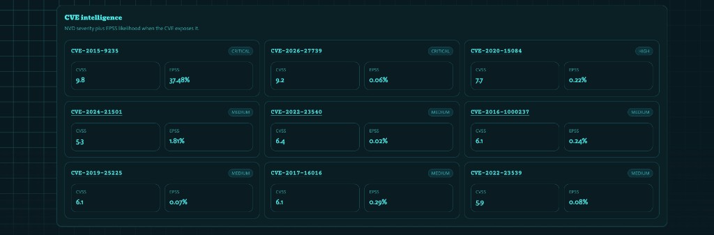

# Repo Risk Radar


Repo Risk Radar is a defensive fullstack dependency-risk scanner for public GitHub repositories. It checks dependencies with exact version matches against OSV, enriches CVE data with NVD + EPSS, and generates a deterministic release gate and developer-ready remediation plan.

The project is defensive-only: it focuses on vulnerability awareness, prioritization, and remediation. It does not generate exploit code, attack payloads, or offensive instructions.

## Highlights

- **Defensive dependency intelligence** from public GitHub manifests/lockfiles.
- **OSV.dev vulnerability matching** using exact resolved versions.
- **NVD + EPSS enrichment** (risk + probability signals).
- **Deterministic release gate**: `PASS`, `WARN`, or `BLOCK`.
- **Developer-ready remediation**: structured fix guidance and a release-gate “ticket”.
- **Optional narrative**: OpenAI is only used to explain and format, never to invent vulnerabilities or change the deterministic decision.

## Screenshots



*Scan input: paste any public GitHub URL, toggle AI narrative, or load the demo scan.*



*AI Release Gate: deterministic BLOCK/WARN/PASS decision with evidence, required actions, and a ready-to-paste developer ticket.*



*Exploitability map (CVSS × EPSS bubble chart) and OSV scan coverage breakdown.*



*Prioritized findings table ranked by risk score, alongside an AI-generated remediation plan.*



*CVE intelligence tiles showing NVD severity and EPSS exploitation-probability per CVE.*

## Architecture

```mermaid
flowchart LR
  U[User] -->|Paste public GitHub repo URL| C[Web client (Next.js)]
  C -->|POST /api/scans| S[Server (NestJS)]
  S -->|spawn Python process| A[Agent (Python CLI)]
  A -->|OSV queries| O[OSV.dev]
  A -->|Enrich| N[NVD]
  A -->|Enrich| E[EPSS]
  A -->|Rank + policy| P[Risk ranker + Release gate policy]
  P -->|Structured scan JSON| A
  A -->|stdout JSON| S
  S -->|scan JSON| C
  C --> R[Remediation dashboard]
```

## Safety Model

> [!IMPORTANT]
> Repo Risk Radar is designed for **defensive security** only.
> 
> - Only public `https://github.com/owner/repo` URLs are analyzed.
> - Repository code is not executed.
> - API keys are kept server-side and must not be exposed to the frontend.
> - OpenAI calls are used only for explanation/formatting (when enabled).

## How a scan works

1. The client sends `POST /api/scans` with `{ repoUrl, noAi }`.
2. The server spawns the Python agent: `python -m repo_risk_radar analyze <repoUrl> --json`.
3. The agent fetches supported dependency manifests from the repo (and only those).
4. Dependencies with **exact resolved versions** are matched against **OSV.dev**.
5. CVE aliases are enriched with **NVD** and **EPSS** signals.
6. Findings are ranked and passed through the deterministic **Release Gate** policy.
7. The response includes:
   - `findings`
   - `narrative` (optional / may be deterministic fallback)
   - `release_gate` (deterministic decision + evidence + remediation ticket)
   - `server_cache.hit` metadata

## Supported inputs

- Public GitHub URLs (must be `https://github.com/...`).
- Supported manifest sources include lockfiles/pinning where available (for strongest OSV matching).

## Quick Start

```bash
npm install
python -m venv .venv
source .venv/bin/activate
python -m pip install -e "apps/agent[dev]"
cp .env.example .env
```

## Environment Variables

Root `.env` drives both the server and agent.

```bash
OPENAI_API_KEY=
OPENAI_MODEL=gpt-4.1-mini
GITHUB_TOKEN=
NVD_API_KEY=

# Frontend-to-backend base URL
NEXT_PUBLIC_API_BASE_URL=http://localhost:4000/api

# Server settings
CLIENT_ORIGIN=http://localhost:3000
PORT=4000

# Optional: force server to use a specific Python interpreter
AGENT_PYTHON=

# Cache scan results on the server
SCAN_CACHE_TTL_SECONDS=900
```

- `OPENAI_API_KEY` is optional. If missing, the agent uses deterministic output without OpenAI narrative.
- `GITHUB_TOKEN` and `NVD_API_KEY` are optional but improve rate limits and enrichment completeness.

> [!NOTE]
> Do **not** commit `.env` (the root `.gitignore` excludes it).

## Run Locally

Dev mode for the full monorepo:

```bash
npm run dev
```

Or run apps separately:

```bash
npm run dev --workspace @repo-risk-radar/server
npm run dev --workspace @repo-risk-radar/client -- --port 3000
```

Open the dashboard:
- `http://localhost:3000`

API:
- `http://localhost:4000/api`

## API

Health check:

```bash
curl http://localhost:4000/api/health
```

Run a scan:

```bash
curl -X POST http://localhost:4000/api/scans \
  -H 'Content-Type: application/json' \
  -d '{"repoUrl":"https://github.com/owner/repo","noAi":true}'
```

Demo scan data (no external enrichment calls):

```bash
curl http://localhost:4000/api/scans/demo
```

### Response shape

The scan response includes `findings`, `narrative`, and `release_gate`. `release_gate` contains the deterministic decision, risk score, reasons, required actions, unknowns, evidence, and developer ticket text.

## Agent CLI (standalone)

```bash
cd apps/agent
../../.venv/bin/python -m repo_risk_radar analyze https://github.com/owner/repo
../../.venv/bin/python -m repo_risk_radar analyze https://github.com/owner/repo/tree/branch-name --json
../../.venv/bin/python -m repo_risk_radar analyze https://github.com/owner/repo --release-gate
../../.venv/bin/python -m repo_risk_radar analyze https://github.com/owner/repo --ticket
../../.venv/bin/python -m repo_risk_radar analyze https://github.com/owner/repo --output ../../reports/example.md
../../.venv/bin/python -m repo_risk_radar self-test
```

## Confidence Checks

```bash
npm run build
npm run lint --workspace @repo-risk-radar/client
npm run lint --workspace @repo-risk-radar/server
cd apps/agent && ../../.venv/bin/python -m ruff check . && ../../.venv/bin/python -m pytest
cd apps/agent && ../../.venv/bin/python -m repo_risk_radar self-test
npm audit --omit=dev
```

## Deployment: Vercel (client) + Render (server + agent)

This stack supports true end-to-end behavior because the **NestJS server spawns the Python agent** inside the same runtime (a single Docker container on Render).

### 1) Deploy the server (Render)

- Deploy the repo on Render using the root `Dockerfile`.
- Ensure Render sets:
  - `CLIENT_ORIGIN` to your Vercel URL (CORS allowlist)
  - `GITHUB_TOKEN` (recommended)
  - `NVD_API_KEY` (recommended)
  - `OPENAI_API_KEY` (optional; required only for narrative enrichment)

### 2) Deploy the client (Vercel)

- Create a Vercel project for the monorepo with **Root Directory**: `apps/client`
- Set:
  - `NEXT_PUBLIC_API_BASE_URL=https://<your-render-domain>/api`

After both deployments, the dashboard should be able to scan repos end-to-end: client -> server -> Python agent -> OSV/NVD/EPSS -> remediation UI.

## Limitations (and opt-in network scanning)

Nmap and OpenVAS are useful defensive tools for network and host exposure assessment, but they are not a default path for public repository dependency analysis. This app keeps dependency-risk scanning as the default and leaves network scanning as future opt-in integrations for assets the user owns or has permission to test.

## Roadmap

1. Persist scan history and compare drift over time.
2. Add authenticated GitHub token setup in the UI.
3. Add Trivy or Grype as an optional local open-source dependency/container scanner.
4. Add opt-in OpenVAS/Nmap jobs for owned targets only.
5. Add PDF export and GitHub issue generation.
